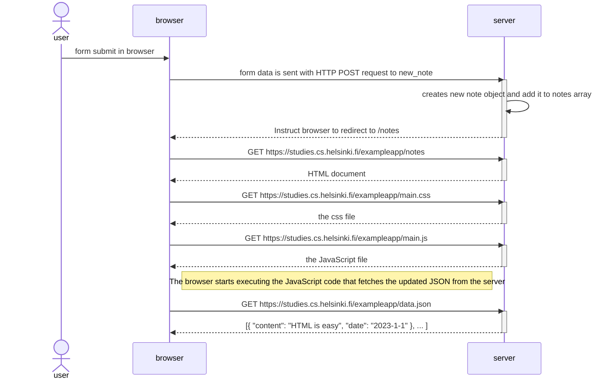

```mermaid
  sequenceDiagram
      actor user
      participant browser
      Participant server
      user->>browser: form submit in browser
      browser->>server: form data is sent with HTTP POST request to new_note
      activate server
      server->>server: creates new note object and add it to notes array
      server-->>browser: Instruct browser to redirect to /notes
      deactivate server
      browser->>server: GET https://studies.cs.helsinki.fi/exampleapp/notes
      activate server
      server-->>browser: HTML document
      deactivate server

      browser->>server: GET https://studies.cs.helsinki.fi/exampleapp/main.css
      activate server
      server-->>browser: the css file
      deactivate server

      browser->>server: GET https://studies.cs.helsinki.fi/exampleapp/main.js
      activate server
      server-->>browser: the JavaScript file
      deactivate server

      Note right of browser: The browser starts executing the JavaScript code that fetches the updated JSON from the server

      browser->>server: GET https://studies.cs.helsinki.fi/exampleapp/data.json
      activate server
      server-->>browser: [{ "content": "HTML is easy", "date": "2023-1-1" }, ... ]
      deactivate server    
``` 
