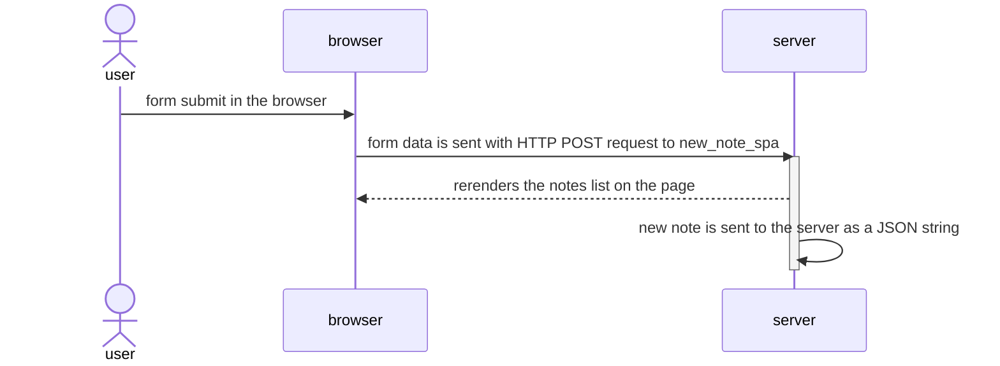

```mermaid
  sequenceDiagram
      actor user
      participant browser
      Participant server
      user->>browser: form submit in the browser
      browser->>server: form data is sent with HTTP POST request to new_note_spa
      activate server
      server-->>browser: rerenders the notes list on the page
      server->>server: new note is sent to the server as a JSON string
      deactivate server 
``` 
